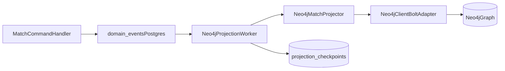
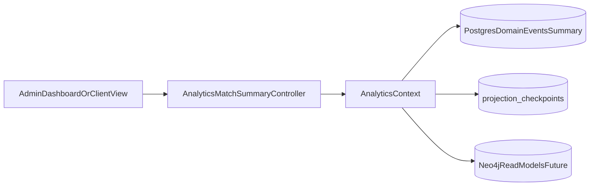
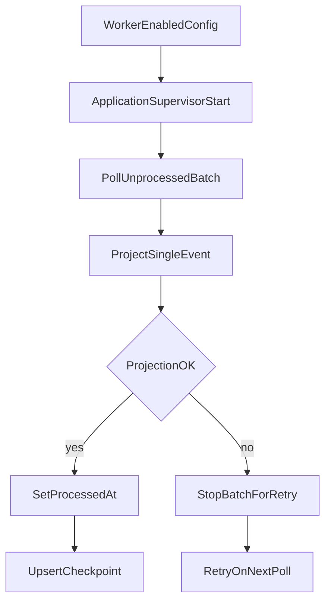

# Analytics Architecture (Phase 4.1)

This document explains how domain events are projected into Neo4j over Bolt and how client analytics reads are served.

## Purpose

- Keep projection flow auditable and restart-safe.
- Keep read contracts stable while projection internals evolve.
- Keep transport details (Bolt client) isolated behind an adapter.

## Event Projection Flow

Flow notes:

- `domain_events` is the durable source of truth for projection replay.
- `Neo4jProjectionWorker` reads unprocessed events in insertion order.
- `Neo4jMatchProjector` maps event payloads to Cypher statements.
- `Neo4jClient.Bolt` executes Cypher using Bolt transport (`neo4j_ex` driver).
- `projection_checkpoints` tracks projection progress per projection name.

## Analytics Read Flow

Flow notes:

- First read contract is `GET /api/v1/analytics/matches/summary`.
- Endpoint currently serves deterministic summary from `domain_events` scope filters.
- Contract is designed so backing implementation can move to Neo4j projections later without route changes.

## Worker Control and Recovery

Recovery notes:

- Failed projection stops the batch and leaves event unprocessed.
- Next worker cycle retries from the same event.
- Checkpoint only advances after successful projection and processed marking.
